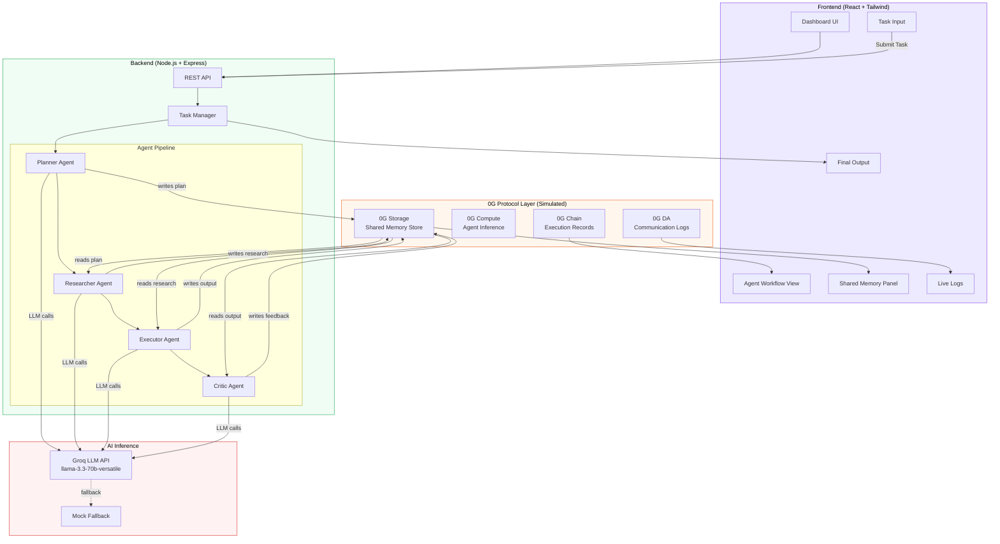
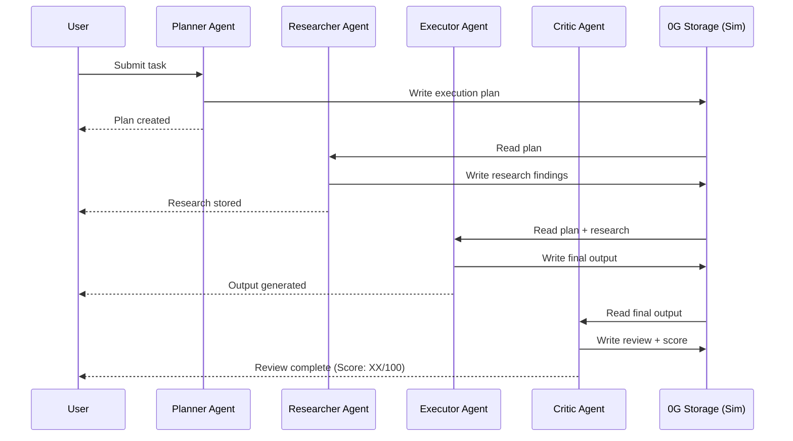

# 0G Agent Swarm OS

**Decentralized Multi-Agent Collaboration powered by 0G**

A professional web dashboard demonstrating how multiple AI agents collaborate through shared persistent memory on the 0G decentralized network. Built for the 0G Hackathon.


---

## Architecture



### Agent Flow



---

## Demo Script (Under 3 Minutes)

> Use this script to demo the project in a hackathon presentation.

| Time | Action | What to Show |
|------|--------|-------------|
| **0:00 - 0:20** | **Intro** | Open the dashboard. Explain: "0G Agent Swarm OS is a decentralized multi-agent collaboration system. Four AI agents work together through shared memory powered by 0G infrastructure." |
| **0:20 - 0:40** | **Submit a task** | Type a task like "Research and create a market analysis report on AI agents" and click **Run Task**. |
| **0:40 - 1:30** | **Watch the agents** | Point out each agent activating in sequence: Planner breaks down the task, Researcher gathers data, Executor creates the report, Critic reviews quality. Highlight the real-time progress bars and status badges. |
| **1:30 - 2:00** | **Shared Memory** | Point to the Shared Memory panel: "Every agent read/write goes through 0G Storage Simulation. You can see 6 entries — each with a 'Stored in 0G Storage Simulation' status. This is where real 0G Storage SDK would plug in." |
| **2:00 - 2:20** | **Live Logs** | Scroll the Live Logs: "These show the exact memory operations — 'Planner wrote plan to 0G Storage', 'Researcher fetched planner output'. In production, these are 0G DA layer events." |
| **2:20 - 2:40** | **Final Output** | Show the Final Output card: "The purple badge shows this was powered by Groq LLM. The review score is dynamic — the Critic agent actually evaluated the output." |
| **2:40 - 3:00** | **Why 0G** | Scroll to the "Why 0G Matters" section. Briefly mention: "Storage for agent memory, Compute for inference, DA for logs, Chain for verification. All designed to plug into real 0G SDKs." |

### Demo Tips
- Have the Groq API key configured so agents return real AI responses (the badge shows "Groq LLM")
- Prepare 2-3 different task prompts in case of questions
- Keep the browser dev tools closed for a clean look

---

## Protocol Features Used

### 0G Storage — Shared Agent Memory

All agent interactions persist in a shared memory store that simulates 0G's content-addressable blob storage.

- **What it stores:** Task data, planner output, research findings, executor output, critic feedback, final results
- **How agents use it:** Each agent reads from previous agents' outputs and writes its own results
- **UI indicator:** Every memory entry shows a green "Stored in 0G Storage Simulation" badge
- **Production path:** Replace `memoryStore.js` with `@0glabs/0g-ts-sdk` for real decentralized storage

### 0G Compute — Decentralized AI Inference (via Groq LLM)

Each agent makes LLM calls to generate intelligent responses. Currently powered by Groq API as a stand-in for 0G Compute.

- **Model:** `llama-3.3-70b-versatile`
- **Agent prompts:** Each agent (Planner, Researcher, Executor, Critic) has a distinct system prompt
- **Fallback:** Automatically uses mock responses when no API key is set
- **Production path:** Replace Groq API calls with 0G Compute SDK for decentralized inference

### 0G DA — Data Availability for Agent Logs

Agent communication events are logged and displayed in the Live Logs panel, simulating the 0G DA layer.

- **Events logged:** Memory writes, memory reads, task status changes, agent transitions
- **UI:** Live Logs panel with color-coded entries (green for storage, blue for agent actions, purple for reads)
- **Production path:** Publish agent logs to 0G DA for reliable, scalable event availability

### 0G Chain — Verifiable Execution Records

Each agent action is tracked with timestamps and metadata, simulating on-chain execution receipts.

- **Tracked data:** Agent name, action type, timestamp, data size, storage status
- **UI:** Agent Workflow panel shows sequential execution with status badges
- **Production path:** Record agent actions as on-chain transactions for verifiable audit trails

---

## Current Implementation vs Future 0G SDK Integration

| Feature | Current (Hackathon) | Future (0G SDK) |
|---------|-------------------|-----------------|
| **Agent Memory** | In-memory JavaScript store (`memoryStore.js`) | `@0glabs/0g-ts-sdk` content-addressable blob storage |
| **AI Inference** | Groq LLM API (`llama-3.3-70b-versatile`) | 0G Compute SDK for decentralized inference |
| **Data Persistence** | Resets on server restart | Permanent decentralized storage on 0G network |
| **Agent Logs** | In-memory log array | 0G DA layer for scalable, reliable event availability |
| **Execution Proofs** | Timestamp metadata | 0G Chain on-chain transaction receipts |
| **Access Control** | Open API endpoints | 0G Chain wallet-based agent identity and permissions |
| **Data Integrity** | Trust the server | Content-addressable hashes verify data hasn't been tampered with |
| **Scalability** | Single server instance | Distributed across 0G network nodes |

### Integration Readiness

The codebase includes `TODO [0G Storage]`, `TODO [0G Compute]`, `TODO [0G DA]`, and `TODO [0G Chain]` comments at every integration point:

- **`server/store/memoryStore.js`** — Replace in-memory arrays with `zgStorage.upload()` / `zgStorage.download()`
- **`server/routes/tasks.js`** — Replace Groq API with 0G Compute; log actions to 0G Chain
- **`server/routes/memory.js`** — Replace store reads with 0G Storage SDK queries
- **`server/services/groqClient.js`** — Replace with 0G Compute SDK inference client

---

## Screenshots

> Replace these placeholders with actual screenshots of your running application.

### Dashboard — Initial State
<!--  -->
_Screenshot: Clean dashboard with task input, empty agent workflow, shared memory panel, and live logs._

### Agent Workflow — In Progress
<!--  -->
_Screenshot: Agents executing in sequence with progress bars and status badges._

### Completed Task — Full Results
<!--  -->
_Screenshot: All 4 agents completed, 6 memory entries with "Stored in 0G Storage Simulation", Final Output with Groq LLM badge._

### Live Logs — 0G Storage Operations
<!--  -->
_Screenshot: Live logs showing "wrote to", "fetched from", "persisted" 0G Storage Simulation messages._

### Why 0G Matters Section
<!--  -->
_Screenshot: Four cards explaining Storage, Compute, DA Layer, and Chain._

### Mobile Responsive View
<!--  -->
_Screenshot: Mobile layout with bottom navigation and single-column cards._

---

## Features

- **Task Input System** — Submit tasks for the agent swarm to collaboratively solve
- **AI-Powered Agents** — Real LLM responses via Groq API (with mock fallback)
- **Multi-Agent Workflow** — Visual real-time progress of 4 specialized agents
- **Shared Memory (0G Storage Simulation)** — Transparent view of all data stored by agents with status messages
- **Live Logs** — Real-time activity feed showing agent reads/writes to 0G Storage Simulation
- **System Overview** — Active agents, memory entries, uptime, storage metrics
- **Final Output** — View and download completed results with LLM source indicator
- **Why 0G Matters** — Clear explanation of each 0G infrastructure component
- **Responsive Design** — Desktop sidebar + mobile bottom navigation

---

## Tech Stack

| Layer | Technology |
|---|---|
| Frontend | React 18, Tailwind CSS 3.4, Vite, Lucide Icons |
| Backend | Node.js, Express |
| AI/LLM | Groq API (llama-3.3-70b-versatile) with mock fallback |
| State | In-memory store (simulating 0G Storage) |
| Build | Vite |

---

## Setup Instructions

### Prerequisites

- Node.js 18+ installed
- npm 8+
- (Optional) Groq API key for real AI responses

### Quick Start

```bash
# 1. Clone the repository
git clone https://github.com/RukonKholifa/0G-Agent-Swarm-OS.git
cd 0G-Agent-Swarm-OS

# 2. Install all dependencies
npm run install:all

# 3. (Optional) Add your Groq API key
cp .env.example .env
# Edit .env and add your GROQ_API_KEY
# Get a free key at: https://console.groq.com/keys

# 4. Start the development servers (frontend + backend)
npm run dev
```

The app will be available at:
- **Frontend:** http://localhost:5173
- **Backend API:** http://localhost:3001

### Adding Groq API Key

1. Get a free API key from [Groq Console](https://console.groq.com/keys)
2. Create a `.env` file in the project root:
   ```
   GROQ_API_KEY=your_groq_api_key_here
   ```
3. Restart the backend server
4. The server will log `Groq LLM enabled` on startup

Without the key, the app uses mock responses — the demo is fully functional either way.

---

## Deployment

### Environment Variables Reference

| Variable | Where | Required | Description |
|----------|-------|----------|-------------|
| `GROQ_API_KEY` | Backend (Render) | No | Groq API key for real LLM responses. Without it, mock responses are used. Get a free key at [console.groq.com/keys](https://console.groq.com/keys) |
| `PORT` | Backend (Render) | No | Server port (defaults to `3001`). Render assigns this automatically. |
| `NODE_ENV` | Backend (Render) | No | Set to `production` for deployed environments |
| `VITE_API_URL` | Frontend (Vercel) | Yes (if separate deploy) | Full URL of your deployed backend (e.g., `https://your-app.onrender.com`). Not needed when running locally — Vite proxy handles it. |

### Frontend — Vercel

1. Push your code to GitHub
2. Go to [vercel.com](https://vercel.com) and import the repository
3. Configure the build settings:
   - **Framework Preset:** Vite
   - **Root Directory:** `client`
   - **Build Command:** `npm run build`
   - **Output Directory:** `dist`
4. Add environment variable:
   - `VITE_API_URL` = your deployed backend URL (e.g., `https://your-app.onrender.com`)
5. Deploy

> The frontend reads `VITE_API_URL` at build time. When set, API requests go to `${VITE_API_URL}/api/*`. When not set (local dev), requests go to `/api/*` and Vite proxies them to `localhost:3001`.

### Backend — Render

1. Go to [render.com](https://render.com) and create a new **Web Service**
2. Connect your GitHub repository
3. Configure the service:
   - **Root Directory:** `server`
   - **Build Command:** `npm install`
   - **Start Command:** `node index.js`
   - **Environment:** Node
4. Add environment variables:
   - `GROQ_API_KEY` = your Groq API key (see `server/.env.example` for template)
   - `NODE_ENV` = `production`
5. Deploy

> **CORS:** The backend enables CORS by default, so the Vercel frontend can call the Render backend across origins.

### Alternative: Run Everything Locally

```bash
# Production build
npm run build
cd server && npm start
# App available at http://localhost:3001
```

---

## Project Structure

```
0G-Agent-Swarm-OS/
├── README.md
├── package.json              # Root package with dev scripts
├── .env.example              # Environment variable template
├── .gitignore
├── server/
│   ├── package.json
│   ├── .env.example          # Server environment variable template
│   ├── index.js              # Express server entry (loads .env)
│   ├── services/
│   │   └── groqClient.js     # Groq LLM API client with agent prompts
│   ├── routes/
│   │   ├── tasks.js          # Task creation & agent workflow with Groq
│   │   └── memory.js         # 0G Storage Simulation endpoints
│   └── store/
│       └── memoryStore.js    # In-memory 0G Storage simulation
└── client/
    ├── package.json
    ├── index.html
    ├── vite.config.js
    ├── tailwind.config.js
    ├── postcss.config.js
    ├── public/
    │   └── og-logo.svg
    └── src/
        ├── main.jsx
        ├── App.jsx
        ├── index.css
        ├── api/
        │   └── client.js     # API client
        ├── hooks/
        │   └── useTaskRunner.js  # Task polling hook
        └── components/
            ├── Layout/
            │   ├── Layout.jsx
            │   ├── Sidebar.jsx
            │   ├── Header.jsx
            │   └── MobileNav.jsx
            ├── Dashboard/
            │   ├── CreateTask.jsx
            │   ├── AgentWorkflow.jsx
            │   ├── SharedMemory.jsx
            │   ├── LiveLogs.jsx
            │   ├── SystemOverview.jsx
            │   ├── FinalOutput.jsx
            │   └── WhyOG.jsx
            └── common/
                ├── StatusBadge.jsx
                └── ProgressBar.jsx
```

---

## API Endpoints

| Method | Endpoint | Description |
|---|---|---|
| `POST` | `/api/tasks` | Create and run a new task |
| `GET` | `/api/tasks` | List all tasks |
| `GET` | `/api/tasks/:id` | Get task details with agent status |
| `GET` | `/api/tasks/config/status` | Check if Groq LLM is configured |
| `GET` | `/api/memory` | Get shared memory entries (0G Storage Simulation) |
| `GET` | `/api/memory/stats` | Get system statistics |
| `GET` | `/api/memory/logs` | Get live activity logs |
| `DELETE` | `/api/memory` | Clear all memory (reset simulation) |

---

## License

MIT
